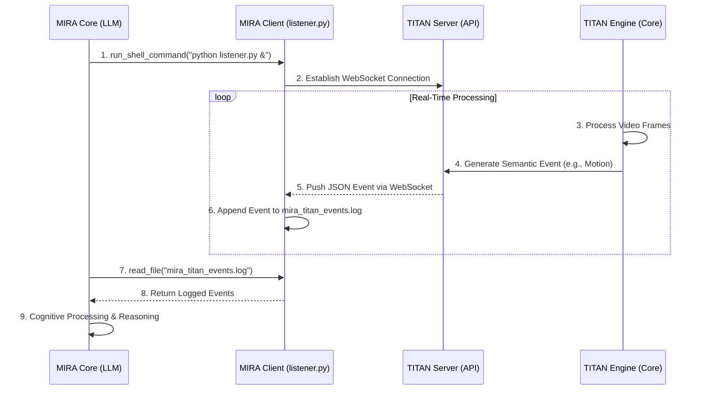

# TITAN-MIRA Integration Architecture

═══════════════════════════════════════════════════════════════
**DOCUMENT STATUS: DRAFT 1.0**
**AUTHOR: MIRA COUNCIL**
**DATE: 29/01/2026**
═══════════════════════════════════════════════════════════════

## 1. Overview

This document outlines the full-stack architecture for the integration of **TITAN VISION OS (TITAN)** as a real-time sensory backend for the **MIRA Cognitive Assistant (MIRA)**. The primary goal of this architecture is to enable MIRA to perceive, reason about, and act upon events occurring in the physical world, transforming it from a text-based assistant into an ambient, context-aware intelligence.

The core principle is **Semantic Event Translation**. Raw, high-bandwidth video data from TITAN is translated into a low-bandwidth stream of structured, meaningful JSON objects that MIRA's cognitive core can ingest and process.

## 2. Architectural Philosophy

- **Sovereign & Local-First:** All processing, from video capture to event generation, occurs on the user's local hardware. No raw data leaves the machine, aligning with MIRA's core directive of privacy and user control.
- **Decoupled & Asynchronous:** MIRA and TITAN operate as separate, decoupled processes. Communication is asynchronous, ensuring that neither system can become a blocking dependency for the other.
- **Client-Server Model:** TITAN acts as the **Server**, managing hardware and running the intensive processing pipeline. MIRA acts as the **Client**, consuming the data and issuing commands through a fleet of specialized Python scripts.

## 3. System Components

The architecture consists of three primary layers:

### 3.1. MIRA Core Layer (The "Brain")

- **MIRA Cognitive Engine:** The existing LLM-based core responsible for reasoning, planning, and tool invocation.
- **`run_shell_command` Tool:** The primary interface for MIRA to interact with the outside world. It is used to launch and manage the MIRA Client scripts.
- **`execution/` Directory:** A dedicated folder containing the Python scripts that form the MIRA Client Layer.

### 3.2. MIRA Client Layer (The "Optic Nerve")

This layer consists of one or more Python scripts running as background processes on the user's machine. MIRA launches these scripts via `run_shell_command`.

- **`listener.py` (Persistent WebSocket Client):**
    - A long-running script that establishes a persistent WebSocket connection to the TITAN Server's Data Plane.
    - Its sole responsibility is to listen for incoming JSON events, validate their schema, and write them to a standardized log file (e.g., `../.tmp/mira_titan_events.log`).
    - It includes robust error handling, automatic reconnection logic, and health checks.
- **`commander.py` (Stateless REST Client):**
    - A short-lived script invoked by MIRA to send specific commands to the TITAN Server's Control Plane.
    - Examples: `python execution/commander.py --activate-node motion_detection`, `python execution/commander.py --set-zoom 2.0`.
    - It sends an HTTP request, awaits a confirmation response, and then terminates.

### 3.3. TITAN Server Layer (The "Eye & Visual Cortex")

This is the core TITAN VISION OS application, exposing its capabilities via a dedicated Python-based API.

- **TITAN Core Engine (Zig/Rust/Julia):** The high-performance, multi-language engine responsible for video capture, memory management, and the nodal processing graph.
- **TITAN API Server (Python/FastAPI):**
    - **Control Plane (REST API):** Exposes endpoints for MIRA to manage the TITAN pipeline. Examples:
        - `POST /nodes/activate`: Activates a specific processing node.
        - `POST /nodes/deactivate`: Deactivates a node.
        - `GET /system/status`: Returns the current state of all nodes and hardware.
    - **Data Plane (WebSocket API):** Provides a topic-based publish/subscribe interface for real-time events.
        - The server pushes structured JSON events generated by the Python nodes in the TITAN pipeline.
        - Example topic: `/events/motion` would publish data from the motion detection node.

## 4. Data Flow & Sequence Diagram

The primary data flow for event perception is as follows:

1.  MIRA uses `run_shell_command` to start `listener.py` as a background process.
2.  `listener.py` connects to the TITAN WebSocket endpoint.
3.  A physical event occurs (e.g., a person enters the frame).
4.  The TITAN Core Engine processes the frames. The `motion_detection` node identifies the person.
5.  The Python wrapper for that node crafts a JSON event payload.
6.  The TITAN API Server publishes this payload to the WebSocket.
7.  `listener.py` receives the JSON and appends it to `mira_titan_events.log`.
8.  Periodically, or when prompted, MIRA uses the `read_file` tool to ingest the new events from the log file for cognitive processing.

## 5. State Management

To overcome MIRA's inherent statelessness, the architecture relies on a combination of event logging and state querying.

- **Event Log (`mira_titan_events.log`):** This file serves as MIRA's short-term memory of the physical world. By reading the log, MIRA can reconstruct the recent sequence of events.
- **State Querying:** If MIRA needs to know the *current* state (e.g., "Is motion detection *still* active?"), it will invoke the `commander.py` script to make a `GET /system/status` request to the TITAN REST API. This ensures MIRA can re-synchronize its world model on demand.

This dual approach allows MIRA to remain fundamentally stateless while still interacting effectively with a stateful, real-time system.
